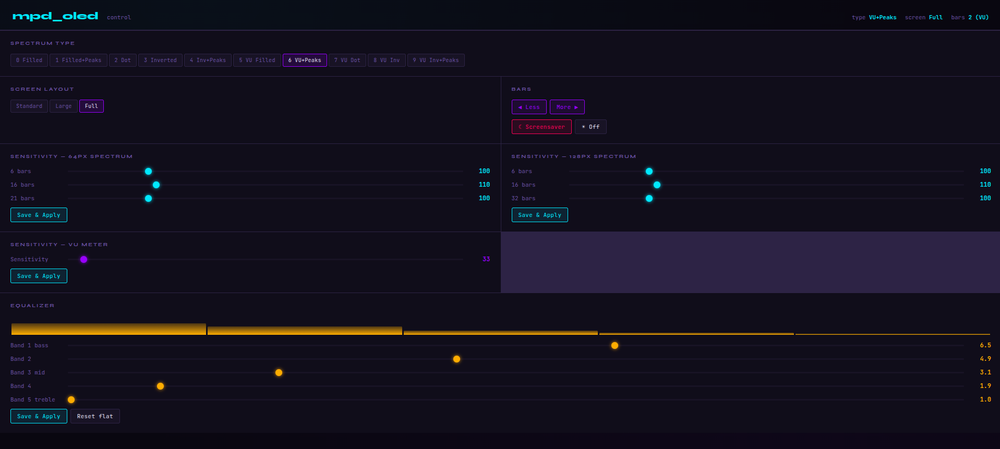

# Moode, Volumio, RuneAudio and MPD OLED Spectrum Display for Raspberry Pi

The mpd_oled program displays an information screen including a music
frequency spectrum on an OLED screen connected to a Raspberry Pi (or similar)
running MPD, this includes Moode, Volumio and rAudio (RuneAudio fork).
The program supports I2C and SPI 128x64 OLED displays with an SSD1306,
SSD1309, SH1106 or SSH1106 controller.


## Install

A binary installation package is provided for Moode and Volumio,
and is the quickest and easiest way to install mpd_oled on these systems.
All other systems should install from source code (Note: the build
commands take a long time to run on a Pi Zero).

### Moode

* [Install mpd_oled from source on Moode 10](doc/install_moode10_source.md)

## Program Help and Options

The following text is printed by running `mpd_oled -h`

Usage: mpd_oled -o oled_type [options] [input_file]

Display information about an MPD-based player on an OLED screen

Options
- `-h,--help` this help message
- `--version` version information
- `-o <type>` OLED type, specified as a number, from the following:
  - 1 Adafruit SPI 128x64
  - 3 Adafruit I2C 128x64
  - 4 Seeed I2C 128x64
  - 6 SH1106 I2C 128x64
  - 7 SH1106 SPI 128x64
- `-b <num>` number of bars to display (default: 16)
- `-g <sz>` gap between bars in pixels (default: 1)
- `-f <hz>` framerate in Hz (default: 15)
- `-A <autosens>` 1 = on, 0 = off
- `-G <sensitivity>` manual sensitivity in %. Autosens must be turned off. 200 means double height.
- `-e <val>` channel selection: 1 = mono, 2 = stereo
- `-F <val>` spectrum view: 0 standard (default), 1 large, 2 full
- `-T <val>` spectrum type: 0-9 (see Spectrum Types below)
- `-t <secs>` display timeout in stop mode: -1 always on, 0-3600 secs
- `-s <vals>` scroll rate (pixels/sec) and start delay (secs), up to four comma separated values (default: 8.0,5.0)
- `-C <fmt>` clock format: 0 - 24h leading 0 (default), 1 - 24h no leading 0, 2 - 12h leading 0, 3 - 12h no leading 0
- `-d` use USA date format MM-DD-YYYY (default: DD-MM-YYYY)
- `-P <val>` pause screen type: p - play (default), s - stop
- `-k` cava executable name is cava (default: mpd_oled_cava)
- `-c` cava input method and source (default: `fifo,/tmp/mpd_oled_fifo`)
- `-R` rotate display 180 degrees
- `-I <val>` invert black/white: n - normal (default), i - invert, number - period in hours
- `-a <addr>` I2C address in hex (default: default for OLED type)
- `-B <num>` I2C bus number (default: 1)
- `-r <gpio>` I2C/SPI reset GPIO number (default: 25)
- `-D <gpio>` SPI DC GPIO number (default: 24)
- `-S <num>` SPI CS number (default: 0)
- `-p <plyr>` Player: mpd, moode, volumio, runeaudio (default: detected)

Example for Moode 10 with Adafruit SPI 128x64 display (OLED type 1):
```
sudo mpd_oled_service_edit -o 1 -A 0 -f 30 -R -t 120 -c alsa,plughw:Loopback,1
```

## Spectrum Types

| Type | Description | Channel |
|------|-------------|---------|
| 0 | Filled spectrum | mono |
| 1 | Filled spectrum + peak hold | mono |
| 2 | Dot spectrum | mono |
| 3 | Inverted spectrum | mono |
| 4 | Inverted spectrum + peak hold | mono |
| 5 | VU meter filled | stereo |
| 6 | VU meter filled + peak hold | stereo |
| 7 | VU meter dot | stereo |
| 8 | VU meter inverted | stereo |
| 9 | VU meter inverted + peak hold | stereo |

## Runtime Controls

mpd_oled accepts commands via a named pipe at `/tmp/mpd_oled_ctrl`, and also
includes a web-based control panel accessible at `http://<raspberry-pi-ip>:8080`:



Example:
```
echo "next_type" > /tmp/mpd_oled_ctrl
```

Available commands:

Cycle spectrum type forward:
```
echo "next_type" > /tmp/mpd_oled_ctrl
```

Cycle spectrum type backward:
```
echo "prev_type" > /tmp/mpd_oled_ctrl
```

Cycle screen layout forward:
```
echo "next_screen" > /tmp/mpd_oled_ctrl
```

Cycle screen layout backward:
```
echo "prev_screen" > /tmp/mpd_oled_ctrl
```

Increase number of bars:
```
echo "bars_up" > /tmp/mpd_oled_ctrl
```

Decrease number of bars:
```
echo "bars_down" > /tmp/mpd_oled_ctrl
```

Set sensitivity (not persisted, resets on type change):
```
echo "sens:150" > /tmp/mpd_oled_ctrl
```

Reset sensitivity to default:
```
echo "sens:-1" > /tmp/mpd_oled_ctrl
```

Toggle screensaver:
```
echo "screensaver" > /tmp/mpd_oled_ctrl
```

Turn off screensaver:
```
echo "screensaver_off" > /tmp/mpd_oled_ctrl
```

Please check the [FAQ](doc/FAQ.md)

## Credits

C.A.V.A. is a bar spectrum audio visualizer: <https://github.com/karlstav/cava>

OLED interface based on ArduiPI_OLED: <https://github.com/hallard/ArduiPi_OLED>
(which is based on the Adafruit_SSD1306, Adafruit_GFX, and bcm2835 library
code).

C library for Broadcom BCM 2835: <https://www.airspayce.com/mikem/bcm2835/>
